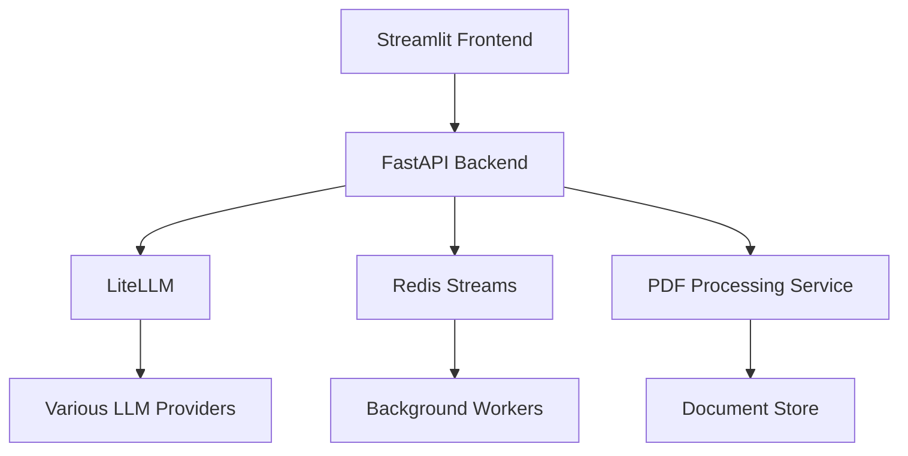

# Miriel: PDF Content Analysis with LLM Integration

## **Introduction**

Miriel is an advanced document processing application that combines PDF parsing capabilities with Large Language Model (LLM) integration to provide intelligent document analysis, summarization, and question-answering features.

## 🌟 Features

- **PDF Processing**

  - Parse PDFs into structured markdown content
  - Extract text, tables, and images
  - Store processed content for future use

- **LLM Integration**

  - Multiple LLM model selection (via LiteLLM)
  - Document summarization
  - Question-answering based on document content
  - Token usage tracking and cost estimation

- **User Interface**
  - Clean, modern web interface
  - Chat-based interaction
  - Real-time processing feedback
  - Document history management

## 🏗️ Architecture



## 🔧 Technical Stack

- **Frontend**: Streamlit
- **Backend**: FastAPI
- **LLM Management**: LiteLLM
- **Message Queue**: Redis Streams
- **PDF Processing**:
  - Custom Python Parser (PyMuPDF, Docling)
  - Llama Parser (Enterprise)
- **Containerization**: Docker & Docker Compose

## 🚀 Getting Started

### Prerequisites

- Python 3.11+
- Docker & Docker Compose
- Redis
- API keys for LLM providers

### Environment Setup

1. Clone the repository:

```bash
git clone https://github.com/yourusername/miriel.git
cd miriel
```

2. Create and activate a virtual environment:

```bash
python -m venv .venv
source .venv/bin/activate  # On Windows: .venv\Scripts\activate
```

3. Install dependencies:

```bash
pip install -r requirements.txt
```

4. Set up environment variables:

```bash
cp .env.example .env
# Edit .env with your API keys and configuration
```

### Running with Docker

1. Build and start the services:

```bash
docker-compose up --build
```

2. Access the application:

- Frontend: http://localhost:8501
- API Documentation: http://localhost:8000/docs

## 📁 Project Structure

```
miriel/
├── frontend/
│   ├── app.py                 # Streamlit application
│   ├── pages/                 # Additional pages
│   └── requirements.txt       # Frontend dependencies
├── backend/
│   ├── api.py                # FastAPI application
│   ├── llm_manager.py        # LiteLLM integration
│   ├── pdf_processor.py      # PDF processing logic
│   └── requirements.txt      # Backend dependencies
├── docker/
│   ├── Dockerfile.frontend
│   ├── Dockerfile.backend
│   └── docker-compose.yml
└── README.md
```

## 🔄 API Endpoints

### PDF Management

- `POST /select_pdfcontent`: Select previously parsed PDF content
- `POST /upload_pdf`: Upload and process new PDF documents

### LLM Integration

- `POST /summarize`: Generate document summaries
- `POST /ask_question`: Process questions about document content

### Model Management

- `GET /models`: List available LLM models
- `POST /select_model`: Select LLM model for processing

## LLMs Integrated

- [GPT-4O](https://platform.openai.com/docs/guides/gpt/gpt-models)
- [Gemini - Flash](https://docs.aimlapi.com/api-references/text-models-llm/google/gemini-2.0-flash-exp)
- [DeepSeek](https://api-docs.deepseek.com/)
- [Claude](https://docs.anthropic.com/en/docs/welcome)
- [Grok](https://docs.x.ai/docs/tutorial)

## Project Deliverables

- **FastAPI Backend**: [https://nehadevarapalli-parseforge.hf.space/](https://nehadevarapalli-parseforge.hf.space/)
- **Streamlit Frontend**: [https://parse-forge.streamlit.app](https://parse-forge.streamlit.app)
- **GitHub Project**: [https://github.com/users/nehadevarapalli/projects/2](https://github.com/users/nehadevarapalli/projects/2)
- **Codelabs Documentation**: [https://codelabs-preview.appspot.com/?file_id=1SZHxAEETpt6-INannVHcy-WhCiZ-rmFsuChKF19sKO8#0](https://codelabs-preview.appspot.com/?file_id=1SZHxAEETpt6-INannVHcy-WhCiZ-rmFsuChKF19sKO8#0)
- **Demo Video**: [Youtube](https://www.youtube.com/watch?v=nrw8KiRCwU4)

## Workflow

1. Upload a PDF via API or frontend or select from exisiting uploads
2. Create a chat thread with selected PDF
3. Ask questions on the PDF content (e.g. Generate Summary)
